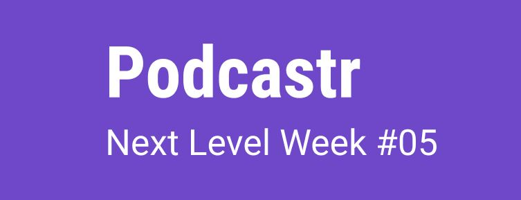
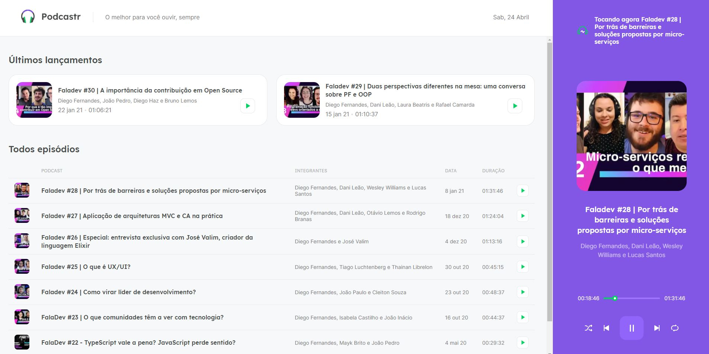
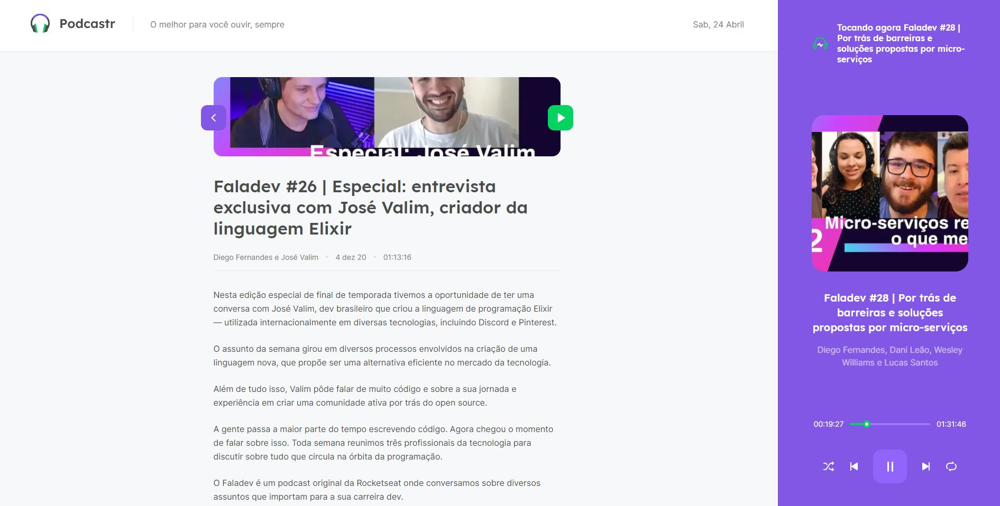

<p align="center">
   
</p>

# :page_with_curl: Table of Contents

* [About](#information_source-about)
* [Technologies](#computer-technologies)
* [Features](#rocket-features)
* [Images](#camera-images)
* [How to run](#seedling-how-to-run)
* [License](#pencil-license)

# :information_source: About

Podcastr is an application to listen to your favorite podcasts from a specific producer. 
The podcasts used are from FalaDev by Rocketseat and the application was developed 
during the Next Level Week 5 event, promoted by Rocketseat itself.

The data used is consumed from a fake API, using the Json Server.

# :computer: Technologies

- [ReactJS](https://pt-br.reactjs.org/)
- [Next.js](https://nextjs.org/)
- [Typescript](https://www.typescriptlang.org/)
- [Json Server](https://github.com/typicode/json-server)

# :rocket: Features

- See the last 2 epidoses
- See the list of episodes
- See episode page
- Listen to an episode
- Player features (play, pause, next, previous, repeat and shuffle)

# :camera: Images

<p float="left" align="center">
  
  
</p>

# :seedling: How to run

### :computer: Web

```bash
# Clone the repository
$ git clone https://github.com/lucas-almeida-silva/podcastr.git

# Go to the project folder
$ cd podcastr

# Install Dependencies
$ yarn
# or npm install

# Run the application
$ yarn dev
# or npm run dev
```
Access the application at http://localhost:3000

### 📦 API

```bash
# Go to the project folder
$ cd podcastr

# Run the fake API
$ yarn server
# or npm run server
```
# :pencil: License

This project is under the [MIT license](LICENSE).
